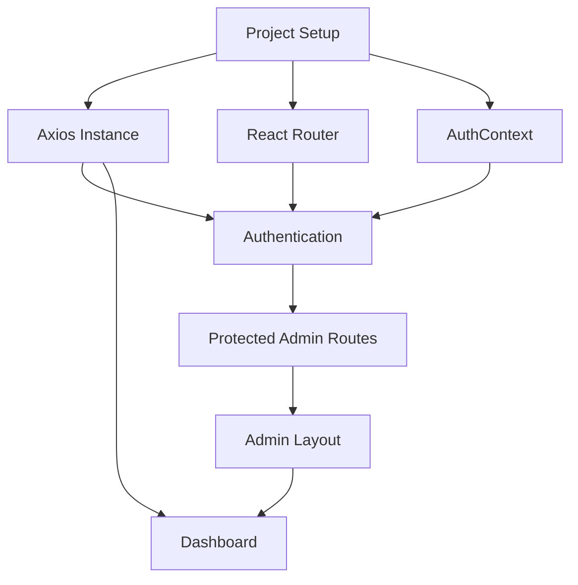

# Week 1 — Setup & Admin Dashboard Foundation

## Goal

Build the technical foundation and the first working version
of the Admin Dashboard.

The week should end with a functional Admin Dashboard that:

- Runs successfully.
- Allows admin login.
- Uses the provided API.
- Has functional sidebar navigation.
- Displays real dashboard data.
- Blocks non-admin users from protected admin routes.

---

## 1. Foundation

### Project Setup

- [ ] Initialize Vite + React
- [ ] Configure Tailwind CSS v4
- [ ] Configure ESLint
- [ ] Establish project structure
- [ ] Configure environment variables
- [ ] Verify local development setup

---

## 2. API Layer

### Axios

- [ ] Create a centralized Axios instance
- [ ] Configure API base URL
- [ ] Read API URL from environment variables
- [ ] Add authentication interceptor
- [ ] Handle unauthorized responses

Expected flow:

```text
Application
    ↓
Axios Instance
    ↓
Auth Interceptor
    ↓
REST API
```

## 3. Authentication

### AuthContext

Implement authentication state management using
React Context API.

Responsibilities:

- Login
- Logout
- Store authentication state
- Restore authentication state when appropriate
- Expose authentication state to the application
- Identify whether the authenticated user is an admin

Expected flow:

```text
Login
  ↓
API
  ↓
Authentication Data
  ↓
AuthContext
  ↓
Application
```

## 4. Routing

### React Router

- Configure application routes
- Create Admin routes
- Create protected route mechanism
- Redirect unauthenticated users
- Block non-admin users from Admin routes

Expected behavior:

```text
Not authenticated
        ↓
      Login

Authenticated customer
        ↓
   Admin route
        ↓
      Block

Authenticated admin
        ↓
   Admin route
        ↓
   Dashboard
```

## 5. Admin Layout

### Layout

- Create Admin Layout
- Create Sidebar
- Add navigation links
- Add active navigation state
- Add logout action
- Make layout responsive

Expected structure:

```text
Admin Layout
│
├── Sidebar
│   ├── Dashboard
│   ├── Products
│   ├── Orders
│   └── Users
│
└── Main Content
```

The exact navigation items should follow the
project requirements and available API functionality.

## 6. Admin Login

### Login Page

- Create Admin Login page
- Build login form
- Add form validation
- Handle API errors
- Show loading state
- Redirect successful admin login to Dashboard
- Prevent authenticated admin users from unnecessarily
returning to the login page

## 7. Dashboard

### Dashboard Home

The Dashboard should display real data from the API.

Required statistics:

- Revenue
- Orders Count
- Customers

Do not hardcode dashboard values.

Expected flow:

```text
Dashboard
    ↓
API Request
    ↓
Real API Response
    ↓
Data Transformation
    ↓
Stats Cards
```

### Dashboard States

The dashboard must account for:

**Loading**

```text
API request in progress
        ↓
Loading UI
```

**Success**

```text
API response
    ↓
Display real statistics
```

**Error**

```text
API request fails
        ↓
Display useful error state
```

## 8. API Integration Checklist

Before considering Week 1 complete:

- API base URL comes from environment variables.
- Axios instance is centralized.
- Authentication is handled consistently.
- Dashboard uses real API data.
- API errors are handled.
- Loading states are handled.
- No credentials are hardcoded.
- No API secrets are committed.

## 9. Protected Route Checklist

Verify all of the following:

```text
Logged out
/admin
   ↓
Login
Logged in as customer
/admin
   ↓
Blocked / Redirected
Logged in as admin
/admin
   ↓
Dashboard
```

## 10. Deliverables

By the end of Week 1:

- Admin Dashboard project runs successfully.
- Admin login works.
- Sidebar navigation is functional.
- Dashboard displays real API data.
- Revenue stats are displayed.
- Orders count is displayed.
- Customers count is displayed.
- Protected routes block non-admin users.

## 11. Definition of Done

A Week 1 task is considered complete when:

- The implementation works locally.
- The code follows the agreed architecture.
- The task is committed using the agreed commit convention.
- The branch has been pushed.
- A Pull Request has been created.
- Required review has been completed.
- The change does not break existing functionality.

## 12. Dependencies

The recommended dependency order is:

```text
Project Setup
      ↓
Axios
      ↓
AuthContext
      ↓
Protected Routes
      ↓
Admin Layout
      ↓
Dashboard
```

More explicitly:



## 13. Team Coordination

Tasks should be assigned based on feature ownership,
not simply by assigning one person to each visual component.

Example:

```text
Foundation
    ↓
Authentication
    ↓
Protected Routes
    ↓
Admin Layout
    ↓
Dashboard
```

Features with dependencies should coordinate before implementation.

## 14. Week 1 Questions / Blockers

Use this section to record questions that require
clarification from the training team.

- API changes / stability
- Additional environment variables
- Stripe test credentials
- Evaluation requirements
- Required checkpoints
- Allowed third-party libraries
- Branding/design restrictions
- Repository requirements

## 15. Week 1 Review

At the end of the week, review:

### Functionality

- Login
- Logout
- Protected routes
- Sidebar
- Dashboard
- Real API data

### Code Quality

- Architecture followed
- No duplicated API logic
- No hardcoded secrets
- Loading/error states handled
- ESLint passes

### Git

- PRs created
- PRs reviewed
- Main branch stable

### Documentation

- Important decisions documented
- Blockers recorded
- WorkCheck updated
